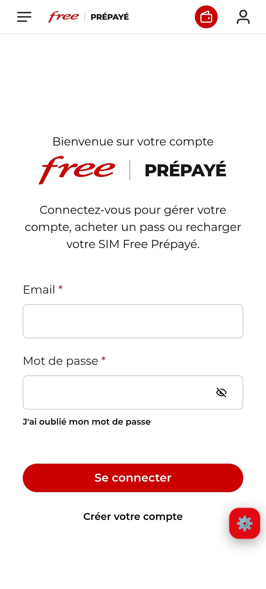
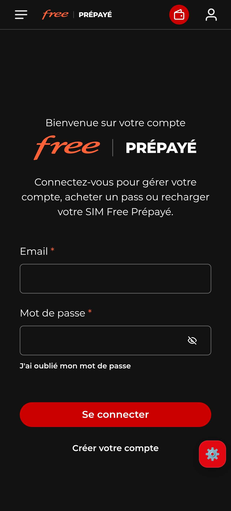
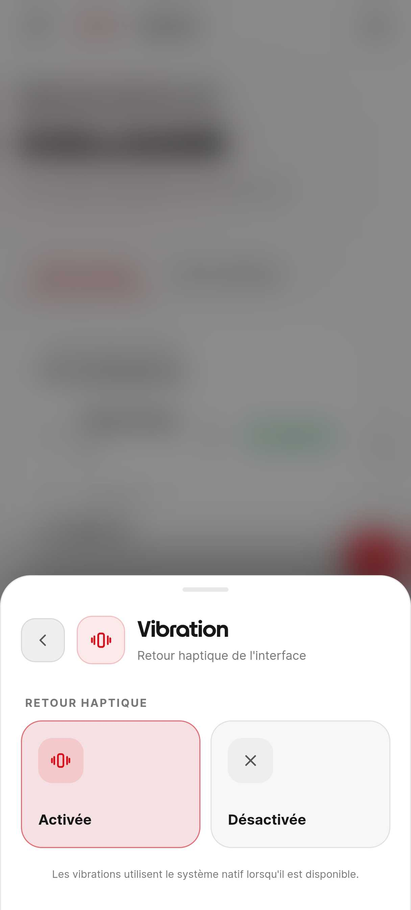
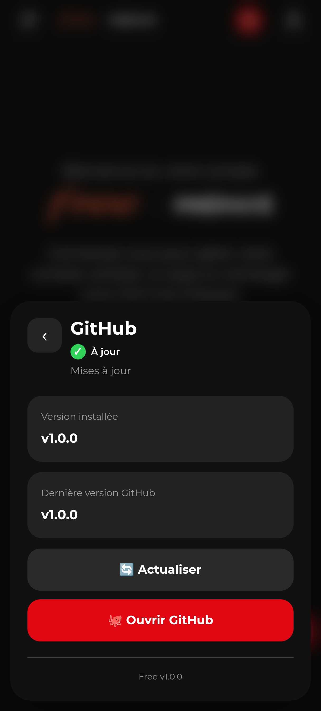

  

  

---

## 🚀 Fonctionnalités

- **Accès instantané** : lancez l'application et accédez directement à votre espace.
- **Interface épurée** : navigation optimisée pour une meilleure lisibilité sur smartphone.
- **Léger** : une application minimaliste qui ne ralentit pas votre téléphone.

---

## ☀️ Mode clair / 🌙 Mode sombre

<table align="center" style="margin: 0 auto; border: none; border-collapse: collapse;">
  <tr style="border: none;">
    <td style="border: none; padding: 0 10px;">
      
    </td>
    <td style="border: none; padding: 0 10px;">
      
    </td>
  </tr>
</table>

### 📳 Vibration / 🔄 Vérification des mises à jour GitHub

<table align="center" style="margin: 0 auto; border: none; border-collapse: collapse;">
  <tr style="border: none;">
    <td style="border: none; padding: 0 10px;">
      
    </td>
    <td style="border: none; padding: 0 10px;">
      
    </td>
  </tr>
</table>

---

## ⚠️ Avertissement important

**Ce projet est une initiative indépendante.**

Cette application n'est en aucun cas affiliée, sponsorisée ou approuvée par **Free Mobile** ou le groupe **Iliad**.

Le développeur décline toute responsabilité concernant l'utilisation de l'application ou du service Free Prépayé. Utilisez l'application à vos propres risques.

---

## 📱 Installation

1. Téléchargez la dernière version `.apk` depuis la section [Releases](https://github.com/NoNameofficials/Free/releases/latest).
2. Autorisez, si nécessaire, l'installation d'applications provenant de sources inconnues dans les paramètres de votre téléphone Android.
3. Installez le fichier et profitez de l'assistant !

---

## 💬 Contact & Support

Besoin d'aide ou envie de suivre l'actualité du projet ?

- [Reddit](https://www.reddit.com/u/_No_Name_404_/s/C0L4W0EToy)
- [YouTube](https://youtube.com/@no_name.official)

---

  

---

## 🛠️ Tech Stack

### 🤖 Assistance IA

---

  <strong>❤️ Vous appréciez le projet ?</strong>
   
  Si l'application vous est utile, pensez à lui laisser une étoile ⭐

  

