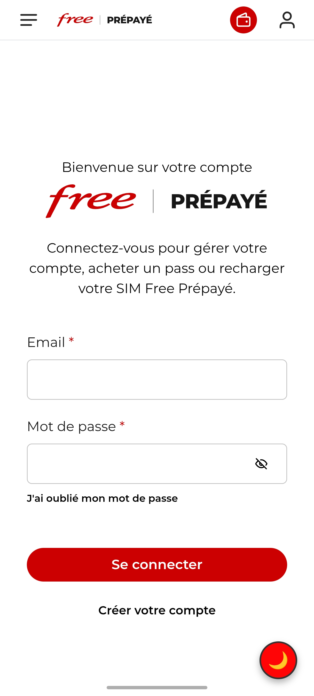
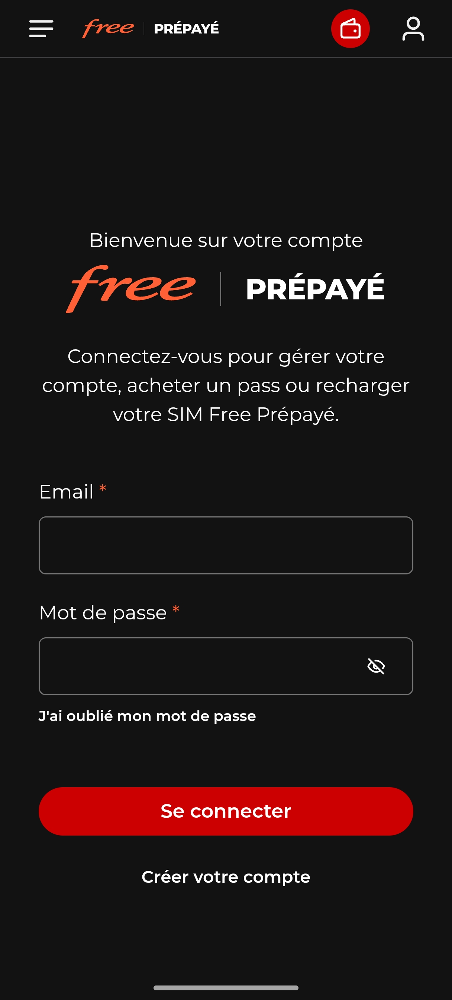

# Assistant Free Prépayé (Non-officiel)

Une application mobile légère et optimisée pour accéder rapidement à votre espace Free Prépayé. 

Ce projet a été conçu pour simplifier le quotidien des utilisateurs : fini de chercher l'URL dans son navigateur, accédez à votre solde et gérez votre forfait en un clic avec une interface pensée pour le mobile.

## 🚀 Fonctionnalités
- **Accès instantané** : Lancez l'application et accédez directement à votre espace.
- **Interface épurée** : Navigation optimisée pour une meilleure lisibilité sur smartphone.
- **Léger** : Une application minimaliste qui ne ralentit pas votre téléphone.

##

      Mode ☀️/🌙 

<table align="center" style="margin: 0 auto; border: none; border-collapse: collapse;">
  <tr style="border: none;">
    <td style="border: none; padding: 0 10px;">
      
    </td>
    <td style="border: none; padding: 0 10px;">
      
    </td>
  </tr>
</table>

## ⚠️ Avertissement important (Non-officiel)
**Ce projet est une initiative indépendante.** 
Cette application n'est en aucun cas affiliée, sponsorisée ou approuvée par la société **Free Mobile** ou le groupe **Iliad**. Le développeur décline toute responsabilité en cas de problème lié à l'utilisation du service. Utilisez cette application à vos propres risques.

## 📱 Installation
1. Télécharger la dernière
`.apk` dans la section [Releases](https://github.com/NoNameofficials/Free-Pr-pay-e-app-/releases/latest).
2. Autorisez l'installation d'applications provenant de sources inconnues dans les paramètres de votre téléphone Android.
3. Installez le fichier et profitez de l'assistant !

## 💬 Contact & Support
Besoin d'aide ou envie de suivre l'actualité du projet ?
- [Reddit](https://www.reddit.com/u/_No_Name_404_/s/C0L4W0EToy)
- [YouTube](https://youtube.com/@no_name.official)

---
*Si vous appréciez ce projet, n'hésitez pas à mettre une étoile sur GitHub !*

## 🛠️ Tech Stack

### 🤖 Assistance IA

